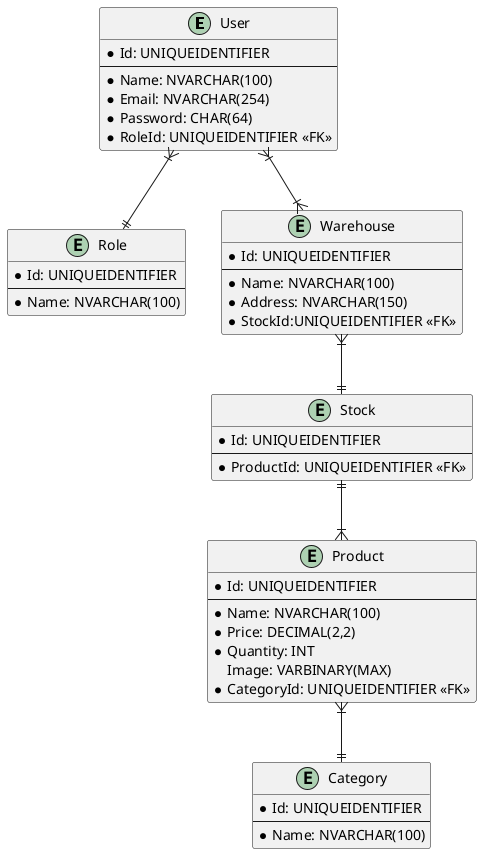

```plantuml
@startuml
entity User {
    *Id: UNIQUEIDENTIFIER
    --
    *Name: NVARCHAR(100)
    *Email: NVARCHAR(254)
    *Password: CHAR(64)
    *RoleId: UNIQUEIDENTIFIER <<FK>>
}

entity Role {
    *Id: UNIQUEIDENTIFIER
    --
    *Name: NVARCHAR(100)
}

entity Stock {
    *Id: UNIQUEIDENTIFIER
    --
    *ProductId: UNIQUEIDENTIFIER <<FK>>    
}

entity Product {
   *Id: UNIQUEIDENTIFIER
   --
   *Name: NVARCHAR(100)
   *Price: DECIMAL(2,2)
   *Quantity: INT
    Image: VARBINARY(MAX)
    *CategoryId: UNIQUEIDENTIFIER <<FK>>
}


entity Category {
    *Id: UNIQUEIDENTIFIER
    --
    *Name: NVARCHAR(100)
}

entity Warehouse {
    *Id: UNIQUEIDENTIFIER
    --
    *Name: NVARCHAR(100)
    *Address: NVARCHAR(150)
    *StockId:UNIQUEIDENTIFIER <<FK>>
}


User }|--|| Role
Product }|--|| Category
Stock ||--|{  Product
Warehouse }|--|| Stock
User }|--|{ Warehouse 

@enduml
```