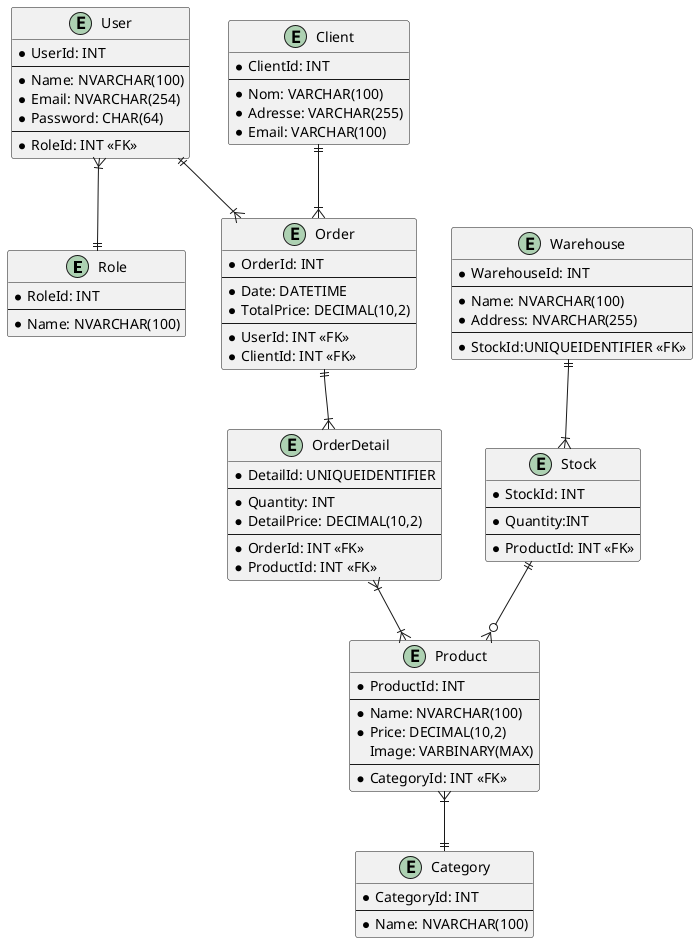

```plantuml
@startuml

entity Role {
    *RoleId: INT
    --
    *Name: NVARCHAR(100)
}

entity Client {
    *ClientId: INT
    --
    *Nom: VARCHAR(100)
    *Adresse: VARCHAR(255)
    *Email: VARCHAR(100)
}

entity User {
    *UserId: INT
    --
    *Name: NVARCHAR(100)
    *Email: NVARCHAR(254)
    *Password: CHAR(64)
    --
    *RoleId: INT <<FK>>
}
entity Order {
    *OrderId: INT
    --
    *Date: DATETIME
    *TotalPrice: DECIMAL(10,2)
    --
    *UserId: INT <<FK>>
    *ClientId: INT <<FK>>
}
entity OrderDetail {
    *DetailId: UNIQUEIDENTIFIER
    --
    *Quantity: INT
    *DetailPrice: DECIMAL(10,2)
    --
    *OrderId: INT <<FK>>
    *ProductId: INT <<FK>>
}

entity Stock {
    *StockId: INT
    --
    *Quantity:INT
    --
    *ProductId: INT <<FK>>
}

entity Product {
   *ProductId: INT 
   --
   *Name: NVARCHAR(100)
   *Price: DECIMAL(10,2)
    Image: VARBINARY(MAX)
--
   *CategoryId: INT <<FK>>
}


entity Category {
    *CategoryId: INT
    --
    *Name: NVARCHAR(100)
}

entity Warehouse {
    *WarehouseId: INT
    --
    *Name: NVARCHAR(100)
    *Address: NVARCHAR(255)
    --
    *StockId:UNIQUEIDENTIFIER <<FK>>
}


User }|--|| Role
Product }|--|| Category
Stock ||--o{  Product
Warehouse ||--|{ Stock
User ||--|{ Order
Order ||--|{ OrderDetail
OrderDetail }|--|{ Product
Client ||--|{ Order

@enduml
```